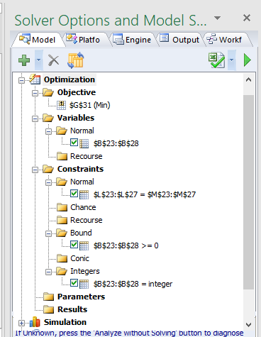

```{r setup, include=FALSE}
knitr::opts_chunk$set(echo = F,fig.align = "center",fig.pos = 'h')
```

# Problem 1

Here there are two scenarios that will be inspected using Integer Linear Programming (ILP) to model total cost. Scenario 1 - plant in Baltimore, Scenario 2 - plant in Seattle.

## Executive Summary:

Both Scenarios yield a total cost of $9,900, therefore any location between Baltimore and Seattle can be chosen.

## Scenario 1

### Formulation:

The model is formulated as a network flow model as shown in the figure below, where nodes 1 through 5 are Los Angeles, Baltimore, Atlanta, Tulsa and New York respectively

```{r, fig.height=2}

```

#### Decision variables:

Let $X_{ij}$ be the flow from node $i$ to $j$ where $i\in \{2,3,4\}$ and $j \in \{1,5\}$

$X_{ij}$ are the decision variables.

#### Other variables

Let $C_{ij}$ be the cost variable for distribution of toys between $X_ij$ 
Let $D_{i}$ be the supply at $i$ and $D_{j}$ be the demand at $j$. $D_{i}$ is denoted with a negative number and the $D_{j}$ as positive number for modeling as a network flow problem.


#### Objective function

$Min$ $Total Cost$ = $X_{ij}C_{ij}$


#### Constraints:

Since the supply equals the demand ($\sum_{i}D_{i}$ $+$ $\sum_{j}D_{j} = 0$), the model will be constrained as 
$Inflow - Outflow = Supply$ $or$ $Demand$. 

The constraints in explicit form are:

$X_{21} + X_{31} + X_{41} - 0 = D_{1}$ where $D_{1} = 800$
$X_{25} + X_{35} + X_{45} - 0 = D_{5}$ where $D_{5} = 1200$

$0 - X_{21} - X_{25} = D_{2}$ Where $D_{2} = -500$
$0 - X_{31} - X_{35} = D_{3}$ Where $D_{3} = -600$
$0 - X_{41} - X_{45} = D_{4}$ Where $D_{2} = -900$

$X_{ij} > = 0$ and $X_{ij}$ are integers


### ASME Modeling

Figures 1 and 2 show the model set up in ASPE

```{r, fig.height=2, fig.cap="ASPE formulation - Baltimore scenario"}

```

```{r, fig.height=2,fig.cap="ASPE Model Setup - Baltimore scenario"}

```


### Scenario 1 Results

The Total cost for a plant in Baltimore was $9900

\pagebreak

## Scenario 2

This is scenario is identical to the previous scenario but the node 2 is replaced with node 6 (seattle) and its respective costs for distribution to Node 1 and 5. The formulation is not repeated here fro brevity. The model set up is shown in figures 3 and 4


The Total cost for a plant in Seattle was $9900. Therefore the either of the scenarios would work for the Toy company.

```{r,fig.height = 3,width = 2,fig.cap="ASPE formulation - Seattle scenario"}

```

```{r,fig.cap="ASPE Model Setup - Seattle scenario", fig.height=3}

```

\pagebreak


# Problem 2

In this problem, the economical combination of four meats for hot dog is formuated as a linear program. The units of weight measures are standardized to grams and all figures are reported in grams  except for calories and cost.

## Executive Summary:

The economical combination would be 14.175 grams of beef and pork and 28.35 grams of turkey. The cost of 2 ounce hot dog would be $0.086

## Formulation

### Decision variables

Let $X_{i}$ be the amount of meat used for hot dog where $i \in \{Beef,Pork, Chicken, Turkey\}$.

### Other variables

Let $D_{i},K_{i},F_{i},L_{i}$ be the Cost, Calories, Fat(grams) and Cholestrol(grams) per gram of hot dog respectively where $i \in \{Beef,Pork, Chicken, Turkey\}$.

### Objective function

$Min$  $\sum_{i}X_{i}D_{i}$

### Constraints

$\sum_{i}X_{i} = 56.7$ (2 ounces = 56.7 grams)
$X_{Chicken} + X_{Turkey} > 0$ (Use of either Chicken or Turkey or both)

Note that in the ASPE, there is no greater than constraint and so greater than on equal to a very small number (0.0000001) was used to model.

$\sum_{i}X_{i}F_{i} <= 6$ Total Fat constraint

$\sum_{i}X_{i}L_{i} <= 27$ Total Cholestrol constraint

$\sum_{i}X_{i}K_{i} <= 100$ Total Calories constraint

$X_{ij} > = 0$

## ASPE Modeling

Figures 5 and 6 show the model set up

{height=50%}

## Result

The economical combination would be 14.175 grams of beef and pork and 28.35 grams of turkey. The cost of 2 ounce hot dog would be $0.086


# Problem 3

## Executive Summary

For 5 Surgery problem, the schedule is as shown in figure 6 with a total setup time of 58. The cost is shown next to the arcs

```{r,fig.cap="5 surgery schedule", fig.height=3}
knitr::include_graphics("Figures/Homework3/p3aS.PNG")
```

For the 10 surgery problem, the schedule is shown in figure 7 with a total setup time of 92.

```{r,fig.cap="10 surgery schedule", fig.height=3}
knitr::include_graphics("Figures/Homework3/p3bS.PNG")
```

## Formulation

The formulation is not reproduced here from the paper. However an attempt was made to make the schedule continuous in ASPE by using a dummy cost parameter.

$dummyCost_{i=j} = 1000 - 1000* \sum_{i}X_{ij}$ $\forall_{j} \in N$

That is, if a schedule ends in node 2, $\sum_{i}X_{i2} = 1$, then $dummyCost_{i=2} = 0$, which encourages the model to schedule a surgery starting from 2. Else the cost would be 1000. 

Also, We need to prevent schedules that re-traces a path example 1->5 -> 1

$X_{12} + X_{21} <= 1$
$X_{13} + X_{31} <= 1$
$X_{14} + X_{41} <= 1$
$X_{15} + X_{51} <= 1$
$X_{23} + X_{32} <= 1$

So on ...

## ASPE Model set up for 5 surgery problem

Figures 8 and 9 show the ASPE model set up

```{r,fig.cap="5 surgery ASPE formulation", fig.height=3}

```

```{r,fig.cap="5 surgery ASPE model set up", fig.height=3}

```

## 5 Surgery problem result

The schedule is 1->2->4->3->5 With a total setup time of 58


## ASPE Model set up for 10 surgery problem

The model set up identical to the 5 surgery problem (as shown in figure 11 and 12). For brevity the model is shown by filtering on $X_{ij} = 1$. The dummy cost did not help with keeping the schedule continuous. There was a degenerative schedule as a result of this type of model. the schedule is shown in figure 10.

```{r,fig.cap="10 surgery degenerative schedule", fig.height=3}
knitr::include_graphics("Figures/Homework3/p3bsnW.PNG")
```

When $X_{51} = 0$ constraint was added to the model, then a plausible schedule resulted.


```{r,fig.cap="10 surgery ASPE formulation", fig.height=3}

```

```{r,fig.cap="10 surgery ASPE model set up", fig.height=3}

```

## 10 Surgery problem result

As shown in figure 10, the schedule is 

1->2 -> 6 -> 3 -> 5 -> 4 -> 10 -> 7 -> 8 -> 9 -> 1, with a total setup time of 92.


# Problem 4

## Data

```{r}
df <- data.frame(Tank = c(1.5,0.5,0.3,2,7), Truck = c(2,0.5,0.6,2,5), Turtle = c(1,1,0,1,4), Available = c(16000,5000,9000,40,164000))
row.names(df) <- c('Plastic','Rubber','Metal', 'Labor','Cost')

knitr::kable(df)
```

## Goals

- Minimize over-utilization of Plastic, Rubber and Metal with twice the emphasis on Plastic.
- Minimize the under and over utilizations of the budget
- Maximize labor utilization

## Decision Variables

Let $X_{1}, X_{2}$ and $X_{3}$ be the number of Tanks, Trucks and Turtles made.

## Goal Constraint:

$1.5X_{1} + 2X_{2} + X_{3} - d_{p}^{+} + d_{p}^{-} = 16000$ (plastic usage)

$0.5X_{1} + 0.5X_{2} + X_{3} - d_{r}^{+} + d_{r}^{-} = 5000$ (rubber usage)

$0.3X_{1} + 0.6X_{2} - d_{m}^{+} + d_{m}^{-} = 9000$ (metal usage)

$2X_{1} + 2X_{2} + X_{3} - d_{l}^{+} + d_{l}^{-} = 40$ (labor usage)

$7X_{1} + 5X_{2} + 4X_{3} - d_{c}^{+} + d_{c}^{-} = 164000$ (budget usage)

Where $d_{p}^{+},d_{r}^{+},d_{m}^{+},d_{l}^{+},d_{c}^{+}$ are over achieving deviational varibles and $d_{p}^{-},d_{r}^{-},d_{m}^{-},d_{l}^{-},d_{c}^{-}$ are under achieving deviational varibles

$d_{p}^{+},d_{r}^{+},d_{m}^{+},d_{l}^{+},d_{c}^{+},d_{p}^{-},d_{r}^{-},d_{m}^{-},d_{l}^{-},d_{c}^{-} >= 0$
 and integer 
$X_{i} >= 0$ and integer

## Objective function

$Min$ $w_{r}\frac {(d_{p}^{+})}{5000} + w_{m} \frac {d_{m}^{+}}{9000} + w_{p} \frac {d_{p}^{+}}{16000} + w_{l}\frac{d_{l}^{-}}{40} + w_{c}\frac{d_{c}^{+}+d_{c}^{-}}{164000}$

where the $w_{r},w_{m},w_{l},w_{c} = 1$ and $w_{p} = 2$

# Problem 5

## Goals

- Achieve total exposures of atleast 750,000 persons
- Avoid expenditures of more than $100,000
- Avoid expenditures of > $70,000 for TV advertisements
- Achieve at least 1 Million total expenditures
- Reach at least 250,000 persons in each of the two age groups 18-21 and 25-30. 
  + In addition purchasing power of 25-30 is twice as much of 18-21 group.

## Decision Variables

$X_{1}$  be the dollar amount spent on TV campaign **in 1000s of dollars**

$X_{2}$  be the dollar amount spent on Radio campaign **in 1000s of dollars**

## Goal constraints

$5500X_{1} + 4500X_{2} + d_{p}^{-} - d_{p}^{+} = 750000$ (goal 1)

$X_{1} + X_{2} + d_{c}^{-} - d_{c}^{+} = 100$ (goal 2)

$X_{1} + d_{t}^{-} - d_{t}^{+} = 70$ (goal 3)

$10000X_{1} + 7500X_{2} + d_{e}^{-}-d_{e}^{+}= 1000000$ (goal 4)

$2500X_{1} + 3000X_{2} + d_{18-21}^{-} + d_{18-21}^{+} = 250000$ (goal 5)

$3000X_{1} + 1500X_{2} + d_{25-30}^{-} + d_{25-30}^{+} = 250000$ (goal 5)


## Objective function

$Min$ $w_{1} \frac{d_{p}^{-}}{750000} + w_{2} \frac{d_{c}^{+}}{100} + w_{3}\frac{d_{t}^{+}}{70} + w_{4}\frac{d_{e}^{-}}{1000000} + w_{5}\frac{0.5*d_{18-21}^{-} + d_{25-30}^{-}}{250000}$

$w_{1} = 5, w_{2} = 4, w_{3} = 3, w_{4} = 2, w_{1} = 1$

Further there is a weight of 0.5 was given to $d_{18-21}^{-}$ to account for purchasing power of 18-21 group being half of 25-30.

# Extra Credit

## a) The different patterns that may be used are 

  - 2 5ft pieces cut
  - 3 3ft pieces cut
  - 2 4ft pieces cut
  - 2 3ft pieces and 1 4ft piece cut
  - 1 4ft piece and 1 5ft piece cut
  - 1 3ft piece and 1 5ft piece cut
  
## b) Formulation

### Decision Variables:

Let $X_{i}$ be the number of boards used to cut in the pattern $i$, where $i$ belongs to the patterns described in the same order as above.

### Objective

$Min$ $\sum_{i} X_{i}$

### Constraints

$3X_{2} + 2X_{4} + x_{6} >= 90$ (number of 3 feet board requirement)

$2X_{3} + X_{4} + X_{5} >= 60$ (number of 4 feet board requirement)

$2X_{1} + X_{5} + X_{6} >= 60$ (number of 5 feet board requirement)

$X_{i} > 0$ and $integers$

### ASME Formulation


### Result

  - *30 boards* for 2 5ft pieces cut
  - *None* for 3 3ft pieces cut
  - *8 boards* for 2 4ft pieces cut
  - *45 boards* for 2 3ft pieces and 1 4ft piece cut
  - *None* for 1 4ft piece and 1 5ft piece cut
  - *None* for 1 3ft piece and 1 5ft piece cut

*The total boards required is 83*
