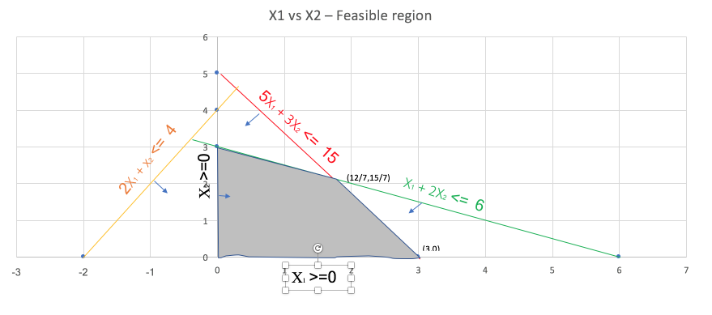

```{r setup, include=FALSE}
knitr::opts_chunk$set(echo = FALSE,fig.show = 'asis')
```


# Problem 1

## Decision Variable:

$S_{ij}$ = number of servings of category $i$ and item $j$. Where $i \in \{1 = Vegetables, 2 = Meat, 3 = Desert\}$ and $j$ for $S_{1j}$ is such that $j \in \{1 = peas, 2 = Green beans, 3 = Okra, 4 = Corn, 5 = Macaroni, 6 = Rice\}$; $j$ for  $S_{2j}$ is such that $j \in \{1 = Chicken, 2 = Beef, 3 = Fish\}$ and $j$ for $S_{3j}$ is such that $j \in \{1 = Orange, 2 = Apple, 3 = Pudding, 4 = Jello \}$

## Objective function

If the cost for each item is denoted by $c_{ij}$, then the objective function can be 
$Minimize$ $\Sigma_{i=1}^{3}\Sigma_{j=1}^{J}S_{ij}C_{ij}$

### in explicit form 

$Minimize$ $z = 0.1S_{11} + 0.12S_{12} + 0.13S_{13} + 0.09S_{14} + 0.1S_{15} + 0.07S_{16} + 0.7S_{21} + 1.2S_{22} + 0.63S_{23} + 0.28S_{31} + 0.42S_{32} + 0.15S_{33} + 0.12S_{34}$

## Constraints

Let Carbs for item $I_{ij}$ be $Cr_{ij}$; likewise vitamins be $V_{ij}$; Protein be $P_{ij}$; Fat be $F_{ij}$

Minimal requirement for Carbs in diet $\Sigma_{i=1}^{3}\Sigma_{j=1}^{J}S_{ij}Cr_{ij} >= 5$
Minimal requirement for Vitamins $\Sigma_{i=1}^{3}\Sigma_{j=1}^{J}S_{ij}V_{ij} >= 10$
Minimal requirement for protein $\Sigma_{i=1}^{3}\Sigma_{j=1}^{J}S_{ij}P_{ij} >= 10$
Minimal requirement for fat $\Sigma_{i=1}^{3}\Sigma_{j=1}^{J}S_{ij}F_{ij} >= 2$

 Atleast one equivalent serving per category

$\Sigma_{j=1}^{J}S_{1j} > = 1$, $\Sigma_{j=1}^{J}S_{2j} > = 1$, $\Sigma_{j=1}^{J}S_{3j} > = 1$

### constraints in explicit form


$S_{11} + S_{12} + S_{13} + 2S_{14} + 4S_{15} + 5S_{16} + 2S_{21} + 3S_{22} + 3 S_{23} + S_{31} + S_{32} + S_{33} + S_{34} > = 5$

$3S_{11} + 5S_{12} + 5S_{13} + 6S_{14} + 2S_{15} + 1S_{16} + 1S_{21} + 8S_{22} + 6S_{23} + 3S_{31} + 2S_{32} + 0S_{33} + 0S_{34} > = 10$

$S_{11} + 2S_{12} + S_{13} + S_{14} + S_{15} + S_{16} + 3S_{21} + 5S_{22} + 6S_{23} + 1S_{31} + 0S_{32} + 0S_{33} + 0S_{34} > = 10$

$0S_{11} + 0S_{12} + 0S_{13} + 2S_{14} + 1S_{15} + 1S_{16} + 1S_{21} + 2S_{22} + 1S_{23} + 0S_{31} + 0S_{32} + 0S_{33} + 0S_{34} > = 2$

$S_{11} + S_{12} + S_{13} +S_{14} + S_{15} + S_{16} >= 1$

$S_{21} + S_{22} + S_{23}  >= 1$

$S_{31} + S_{32} + S_{33} +S_{34} >= 1$


# Problem 2

## Decision Variable:

$X_{ij}$ = Tons of fuel of type $i \in \{1,2,..,m\}$ used in plant $j \in \{1,2,...,n\}$ 

## Other variables:

$b_{j}$ = Total energy used in plant j  BTU/day

$e_{ij}$ = effluent emission per ton of fuel type $i$ at plant $j$

$c_{i}$ = cost per ton of fuel of type $i$

$a_{ij}$ = BTU generated at plant $j$ using one ton of fuel of type $i$


## Objective function:

$Minimize$  $z = \sum_{j=1}^{n}\sum_{i=1}^{m}X_{ij}C_{i}$

## Constraints:

Total energy needed in a plant :

$\sum_{i=1}^{m}X_{ij}a_{ij} = b_{j} \forall j \in \{1,2,...,n\}$

Air pollution per region constraint:

$\sum_{j=1}^{n}\gamma_{j}\sum_{i=1}^{m}e_{ij}X_{ij} <= b$

Non-negative constraints:

$X_{ij} >= 0$

$b_{j} >= 0$

$e_{ij} >= 0$

$a_{ij} >= 0$

$c_{i} >= 0$


# Problem 3

## Decision variables:

$X_{a}$,$X_{b}$,$X_{c}$ and $X_{d}$ be the numbers of products A,B,C and D respectively to be produced.

## Objective function:

$Maximize$ $z = 18X_{a} + 15X_{b} + 13X_{c} + 14X_{d}$

## Constraints:

Contractual constraints and non -negative constraints on the number to be produced:

$X_{a} >= 200$ ; $X_{d} >= 300$ ; $X_{b} >= 0$ ; $X_{c} >= 0$

Production time constraints: 

$3X_{a} + X_{b} + 2X_{c} + X_d <= 40*60$

$8X_{a} + 12X_{b} + 6X_{c} + 7X_d <= 80*60$

$10X_{a} + 6X_{b} + 9X_{c} + 7X_d <= 80*60$

$X_{a} + X_{b} + X_{c} + X_d <= 20*60$

$3X_{a} + 5X_{b} + 3X_{c} + 2X_d <= 40*60$

# Problem 4(a)

$Maximize$  $z = \frac {4x_1 + x_2 - 3x_4 + 1}{2x_1 + x_3 + 4x_4 + 3}$

subject to $x_1 - 2x_2 + x_3 + 2x_4 <= 10$

$x_2 - x_3 + 5x_4 <= 12$

$x_i >= 0, i = 1,..4$

let r = $\frac {1}{2x_1 + x_3 + 4x_4 + 3}$

let $y_1 = x_1r, y_2 = x_2r, y_4 = x_4r$

## Therefore objective function is :

$Maximize$ $4y_1 + y_2 - 3y_4 + r$

Now $x_3$ in terms are r can be written as :

$r(2x_1 + x_3 + 4x_4 + 3) = 1$

$x_3r = 1 - 2y_1-4y_4 - 3r$

## Rewritting the first constraint in terms of y

$y_1 + 2y_2 + 2y_4 >= 1 - 13r$

## likewise the second constraint is 

$y_2 + 9y_4 + 2y_1 - 1 <= 9r$

### Also the non-zero constraints in terms of y are:

$y_1>= 0,y_2>= 0,y_4 >= 0$

# Problem 4(b)

## Objective :
$Minimize$  $5X_1 + 4X_2$

## subject to

$X_1 + 2X_2 <= 6$

$-2X_1 + x_2 <= 4$

$5X_1 + 3X_2 <= 15$

$X_1,X_2 >= 0$





### The objective function is maximized at (12/7,15/7) yielding a value of 17.14.

# Problem 5

## Decision variables :

$x_1,x_2,x_3$ and $x_4$ as number of stocks to be invested in stock 1 through 4 respectively.

## Objective :

$Minimize$ $0.82x_1 + 3.04x_2 + 1.08x_3 + 8x_4$ -> minimum risk investment investment 

## Subject to

### Total investment constraint:

$30x_1 + 45x_2 + 27x_3 + 53x_4 <= 100000$

let  $r = \frac {1}{30x_1 + 45x_2 + 27x_3 + 53x_4}$


### at least 10% return constraint

$\frac {2.9X_1 + 5.42x_2 + 2.6x_3 + 20x_4}{30x_1 + 45x_2 + 27x_3 + 53x_4} > = 0.1$

if we let $y_1 = x_1r$; $y_2 = x_2r$; $y_3 = x_3r$ and  $y_4 = x_4r$

then $2.9y_1 + 5.42y_2 + 2.6y_3 + 20y_4 >= 0.1$

### at least 10% of investment in Stock 4

$\frac {53x_4}{30x_1 + 45x_2 + 27x_3 + 53x_4} > = 0.1$ or

$53x_4r >= 0.1$

$y_4 >= \frac {1}{530}$

## Non negative constraints

$y_1,y_2, y_3$ and $y_4  >= 0$

## re-write objective 


$Minimize$ $0.82\frac {y_1}{r} + 3.04 \frac {y_2}{r} + 1.08\frac {y_3}{r} + 8\frac {y_4}{r}$

## Please turn over to next page

\pagebreak

# Extra credit

The objective is to maximize $cx$, where $c\ne0$

Subject to $Ax <= b$, $x >= 0$

if $A < 0$$ then we have an unbounded constraint as shown below as a red line. Hence any point other than infinite would not be optimal.

if $A > 0$ then x would be maximum when $Ax = b$ there by increasing the objective function $cx$. Any point $x_0$ such that $Ax_0 < b$ would be less than $x$ when $Ax = b$. Hence $x_0$ cannot be the optimal point. This scenario is illustrated by the black line in the plot below with b as a positive upper boundary condition.


